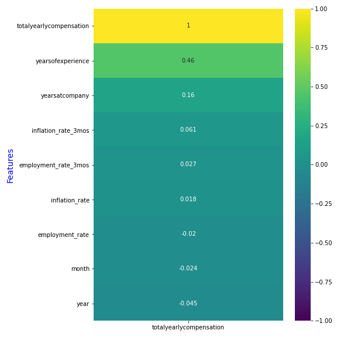
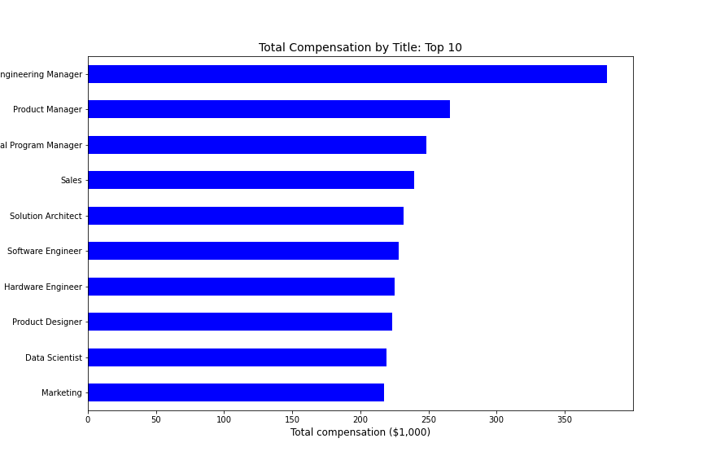

# Group-Project, Data Science Immersive at General Assembly
## Project 5: Predicting employee total compensation

**Authors:**
* Annie Wang
* Hans Baumberger
* Mason Lee and
* Sileshi Hirpa
Making changes...
## Content of the Project:
  * ### Problem statement
  * ### Data wrangling and EDA
  * ### Modeling
  * ### Model Selection
  * ### Conclusions and Recommendation

### **Problem statement:**
Predict employee total compensation based on their professional features (job role, years of experience, etc.), their company and office features (company, office location) and macro-economy features (inflation rate, employment rate)
* Goals:
    1. Provide employees with a reasonable expectation for compensation negotiation
    2. Provide companies an important benchmark for the talent competition, i.e., how much to offer to stay competitive in recruiting
    3. Identify the important features that determine the total compensation, including the company, job role, office location, employees’ experience, and macro-factors such as employment rate and inflation rate.  

The success of the project is measured by the accuracy of the total compensation prediction, i.e., the difference between the actual and the predicted compensation.

Our project is based on the datasets obtained from:
1. web scrapping the Levels.fyi (which lets users compare career levels and compensation packages across different companies) with a  permission from the owners.
2. a csv file from the website [Inflation Rate data for United States of America](https://www.rateinflation.com/inflation-rate/usa-inflation-rate/), and
3. another csv file from the website [USA Inflation Rate](https://data.world/vizwiz/employment-unemployment-by-state-and-month/workspace/file?filename=BLS+Monthly+Unemployment+Rate.xlsx).

The three datasets were merged after making necessary data cleanings and EDA and we named the final set **salary_cleaned.csv**.

* Some of the EDAs we used include:
  1. Features' correlation  

        
2. Top 10 total compensations by title

      

3. Workers' location (top 10)

      

4. Inflation rates

    

5. Unemployment rate in the US

### Final Score

Almost all the models we run took longer time than we expected and hence we have to try one model on **AWS** platform. The following table summarizes the models we tried for this project and we agreed to pick our best model to be ____.

|**Model**|**Training Score (R^2)**|**Testing Score(R^2)**|**MSE(Train)**|**MSE(Test)**|*Comment*|
|--|--|--|--|--|--|
|**Linear Regression(with no penality)**|0.5193|-7.2931Xe^28|8286.35|1.22Xe^27||
|**Lasso Regularization**|0.5182|0.5143|8305.30|8157.45||
|**Ridge Regularization**|0.52|0.5097|8274.20|8234.28||
|**Elastic Net Regularization**|0.4483|0.4499|9511.19|9238.88||
|**Random Forest**|0.466|0.410|9060|10319||
|**Gradient Boosting Regressor (no gridsearch)**|0.5973|0.5318|6834.12|8198.40||
|**Gradient Boosting Regressor (with gridsearch)**|0.7131|0.5477|4867.52|7919.98|Best Model|
|**SVR**|0.1368|-0.1287|||
|**AdaBoost**|0.1930|0.1276|13693|15276||
